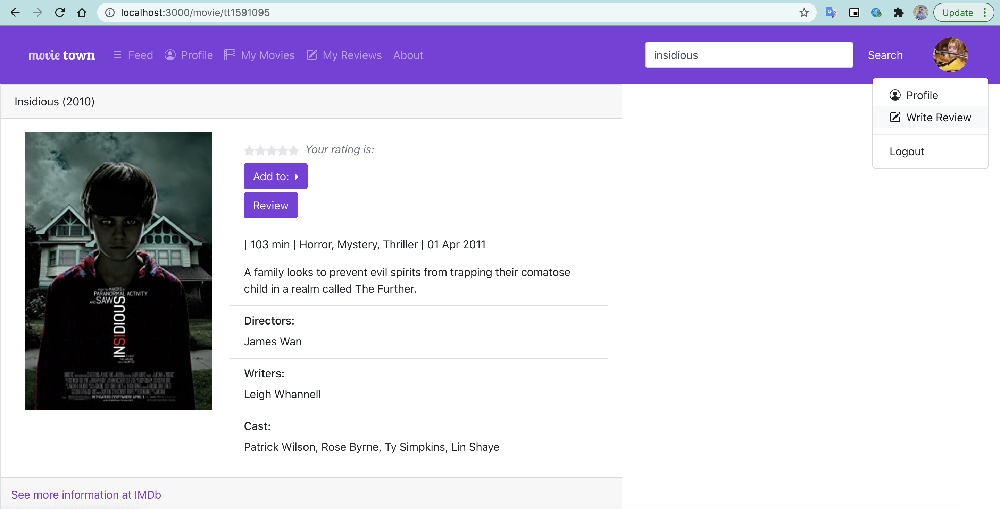
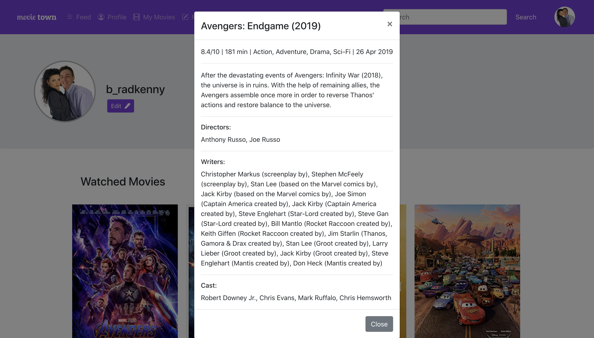
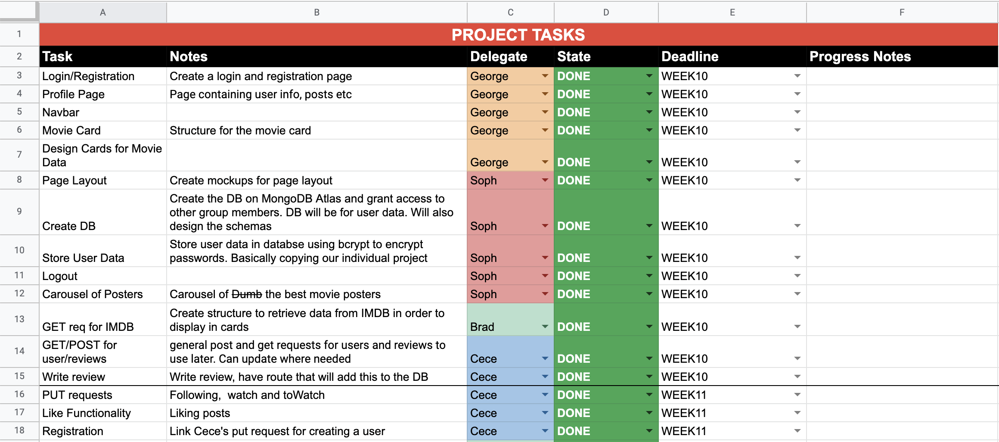

# Group Z Project - Movie Town

<!--Feel free to change the headings around, not sure what they should be set to.-->

## Outline

The purpose of our application is to create an intuitive [IMDb](https://www.imdb.com/) style website with a focus on social features. The application will allow users to keep track of what movies they have watched, want to watch and what movies their friends are watching.

The target user group are avid movie watchers, or those who want to keep track of what they have and haven’t seen. They will be able to mark which movies they have seen, what they would rate it, what their thoughts were, and see what other friends have watched.

We will be using the [OMDb API](http://www.omdbapi.com/) as our main data source for our application. We will also store user data in a [MongoDB](https://www.mongodb.com/) database.

### Target MVP Outline

The application we are aiming to build is a Minimum Viable Product (MVP) that will have enough functionality to show a proof of concept application. We have assigned target features that are planned for the MVP however we have also listed features that will we wish to include once the MVP tasks are completed.

#### Target/MVP Features

-   `User login/registration` : This feature is vital, because it will allow users to interact with the website. There will be no unauthorised view of the website.
-   `Marking shows as "Watched"` : A user should be able to mark shows as “watched” or “want-to-watch”, and then review the lists of shows and their ratings.
-   `View which shows they have watched` : A user should be able to review the list of shows they have watched and their ratings.
-   `Add details to shows` : A user should be able to rate a movie (out of 5 starts), leave a review of what they thought, and record the date they watched it.
-   `Follow friends accounts` : Following another account should allow a user to view all of their friends watchlists and reviews
-   `Liking reviews` : Users can like their friends reviews
-   `Searching` : A user can search for movies to read simple data (plot, year, name etc...)

#### Extra Features

-   `Sort "Watched" list by fields` : It would be nice for users to be able to sort their watchlist by different fields, including their rating, the IMDB average rating, date they watched it etc. This is more complex than a list of shows, and not a vital piece of functionality the application would be dependent on. Rather, it would be a handy feature. Since it is not vital, it is not part of our mandatory list of features.
-   `Creating lists of shows` : A User can create multiple lists of shows (e.g. want to watch, have watched, to watch with kids etc) . This feature will not be included because we are not using a relational database scheme. If we had chosen a different location for our database, this would have been achievable.
-   `Recording what episode you are currently on` : A user can record what episode they are up to in a TV show. This is highly complex and introduces a new purpose to the
-   `Commenting on a friends review` : This is an extension from liking a friends review, a user could also comment on their review. This could be achieved, but would require us to alter the data structure we had currently planned. This feature is one of our stretch goals - if time permits, we will include this.

## What We've Achieved

<!-- Addressing milestones A description of what you have been able to implement in this MVP, use your milestones to highlight what you've achieved -->

For our MVP application we were able to complete all of our target features and some of the extra features. The target features we completed are:

-   `User login/registration` : Users can login and register an account
-   `Marking movies as "Watched"` : Users can add movies to a list of movies they have watched
-   `View of watched movies` : Users can view a list of movies they have watched
-   `Review movies` : Users can write a review on a movie of their choice
-   `Following friends` : Users can follow other users on the users profile page
-   `Liking reviews` : Users can like/unlike reviews
-   `Searching for movies` : Users can search for movies to get information about the movie

The extra features we implemented are as follows:

-   `Delete reviews` : Users can delete their own reviews
-   `Commenting on reviews` : Users can comment on their own or others' reviews
-   `"Want to watch" movie list` : Users can add movies to their "want to watch" list, full of movies they want to see
-   `Search validation` : When searching for a movie to review, form validation is implemented to ensure only valid movie titles are searched
-   `Login/Register form validation` : Form validation has been implemented on login and register cards, restricting users to enter credentials that are long enough. If the user enters a username or password that is too short, an error message is shown below the field. If a user enters a username that is already taken, they must choose a new username. A user is automatically logged in after registration with a default avatar picture.
-   `User Logout` : Users can logout of their account

### Refactoring

Our original project plan did not account for time to refactor our code during the final sprint. Ideally, we would have planned to finish coding earlier and spent the majority of week 13 refactoring our codebase. This would have resulted in cleaner code with a more efficent use of components.

## Source Code

### Back End

Backend code was completed using axios and http requests to communicate with the  MongoDB database, which relies on node.js and express. Below is an outline of each feature.

-   `Nodejs and Express via ./server/server.js` 
	Node.js and Express as the web server platform. nodemon was used during development to automatically restart the server when changes were made. This was only used during development, as no changes are being made to server code after publishing. 

-   `Axios via ./src/axiosServices/reviewServices.js && ./src/axiosServices/userServices.js`
	The axios library provides communication between the browser and the server. Requests for data from the server ares split into requests for the reviews and requests for the users. Requests were written based on data that was needed for the MVP, including post, put, and delete. Requests including post and delete use general URL paths to access and modify data. post requests were split into multiple requests, depending on what was being modified. These can be distinguished by their URL's. These functions are mostly accessed in the main App.js file, but are sometimes accessed directly in a component file. Axios is imported into these files. Functions are defined in the App.js file to be passed around to components for usage as well. state variables are then passed to axios files so after the axios file has requested for data, it can then set the new state of variables accordingly. Some axios functions are written but are not used, and are outlined for usage in the future work section. 

-   `REST HTTP API requests via ./server/api.js`
	HTTP requests are grouped based on wether the interact with data pertaining to reviews, users, or user login. The api router uses express to communicate with the database. Most requests that would be needed are accounted for, including GET, POST, DELETE, and PUT based on the data as a group or individual data pieces based on ID. API URL's are split between the three tasks, and are broken down further based on if a specific data object needs to be accessed based on ID or if a specific PUT request it editting a certain piece of data in the object. Some REST HTTP API requests are written but are not used, and are outlined for usage in the future work section. 

#### _Database_

We have used a MongoDB database to store all user and review information. The two schemas are as follows:

```javascript
const usersSchema = {
	username: String,
	password: String,
	avatar: String,
	follows: Array,
	watched: Array,
	toWatch: Array,
}
```

**NOTES:**

-   The user password is hashed using the bcrypt library.
-   Avatar is a user profile image stored in Flickr
-   watched and toWatch are lists of movie ID's from OMDB.

```javascript
const reviewSchema = {
	username: String,
	titleid: String,
	timestamp: String,
	stars: Number,
	content: String,
	likes: Array,
	comments: Array,
}
```

**NOTES:**

-   Username is the user who wrote the review
-   titleid is the id of the movie from OMDB
-   stars is the users rating of the movie from 0-5.

#### _OMDB Services_

OMDB was used instead of the IMDB API as it was free and allowed us to retrieve data without requiring paid access. They are based on using GET requests to the API route provided by OMDB. Once we created an account with OMDB, we were provided an API key. The API URL and key were stored in an environment variable to ensure we were not sharing this publicly. This was accessible using `process.env.OMDB_API`. 

OMDB proved to be simple to integrate into the project. To do this, we created a series of back-end routes that queried the API and returned relevant data. For example, appending `t=` to the end of the route meant that we could query for movie titles and `i=` meant we could query based on their IMDB ID. The API then returns appropriate JSON data and we use this to return it in each relevant route. 

### Front End

#### _App Component_

The `App.js` component contains various state variables that are passed through other components:

-   `user`: the current user logged into the website. This is an object that contains all user information (i.e. username, avatar, followers, password, watch lists)
-   `users`: a list of all usernames signed up for the web application
-   `reviews`: a list of all reviews made by all users
-   `review`: an object containing information about a review if the review modal is active. This object gets posted to the database
-   `movie`: contains movie information if there is a movie currently searched in the search bar.
-   `show`: a state variable that determines whether a "Write Review" modal is visable or not. If `show` is false, the modal is hidden from view.

The App component contains a router that creates the routes to each of the pages in our application. If the user state variable is empty or null, the user is re-routed to the login page, since only authenticated users can use this application.

#### _Login/Registration_


The login page allows users to log into their account before access the page. The code for this exists in `Login.js` Once details are entered and submited, they are cross checked with the database before a user is re-navigated to the home page. A user will be alerted if they have successfully entered the correct or incorrect password and username.


From the login page, a user also has the option to register an account. This will route users to a new page, featuring code from the `Register.js` file, which will submit a POST request to the database. The object will only be posted if the submitted username is available; part of the register file checks if there is a user with the same username, and stops the creation of accounts with duplicate usernames. This is achieved with the following boolean:

`(users.map(u => u.username).includes(value) === true)`

#### _Movie Card_


A movie card displays all information about a researched movie, as seen in the above screenshot. Included in this component is a button that will make PUT request to the database which updates a logged in users `watched` or `toWatch` list. If the movie already belongs to a list, this button will reflect that. You can also select the "review" button which will display the modal for writing a review. Code for this component can be seen from `MovieCard.js` file.

#### _Review Card_


Similar to a movie card, a review card shows some information on a movie, and a users rating and review of the movie. Other users can comment and like the review, and those changes are made through a PUT request to the database which updates the `likes` and `comments` property on the review. You can access a users profile by selecting their name on the review card. You can also add the movie to you "To Watch" list from the review card. Code for this component can be seen from `ReviewCard.js` file.

#### _Navigation and Search Bar_


From the navigation bar you can access the home feed, your profile, list of your watched and to-watch movies, your reviews and the about page. The navigation bar also has functionality that allows you to search for movies in the OMDB database. When performing a search, the search button will redirect you to a blank page containing a movie card with the closest movie title of your search (successful search shown in image below). A GET request is performed to access to OMDB database. On the far right of the navigation bar is an image containing a users avatar. This also works as a react-bootstrap Dropdown menu, where you have access to your profile, writing a review on any movie, and logging out. This navigation bar appears on each page besides `login` and `register`.

Because the search bar had a lot of it's own functionality, it was seperated into another component called `SearchBar.js`. The remainder of the code for the navigation bar can be found in `NavBar.js`.



#### _Write Review Modal_


There are various buttons across the website that unhide the "Write Review" modal, namely the one on the "My Reviews" page, and on the Dropdown menu in the navbar. There are two modes for the write review button. You either decide to write a review without disclosing the movie - in this case, you can search for the movie you want within the modal. The other case is if the "Review" button is selected on a movie card - in this case, the `movie` field is auto-filled with the movie on the card. This from performs a POST request to the MongoDB database, only if there is content within the review field.

The functionality for this code is split across two files: `ReviewForm.js` and `ReviewModal.js`. The form information is within `ReviewForm` which makes both GET and POST requests to both our database, and the OMDB database. The `ReviewModal` file calls the `ReviewForm` component to display this form within a modal rather than within the web page.

#### _Home Feed_


The home feed contains review cards of all the reviews by users that you follow. These are orded by date. As a stretch goal, we would have liked to have included functionality that allowed users to sort the list in various ways (e.g. by rating, date reviewed, name etc.) Since it was not a vital feature for our "proof-of-concept" application, we prioritised other features. Code for this component can be seen from `Home.js` and the `Feed.js` file. The `Home` file provides the structure for the page, and the `Feed` component creates a stream of `ReviewCard`'s of users that you follow.

#### _Profile_


There are two modes for the profile page. First mode is reviewing your own profile. On this page you can view your profile information, and view a collage of movie posters from a users `watched` list. When you select any of these movie posters, a Modal will appear containing further information about that movie. This functionality comes from the `MoviePoster.js` file.



The profile page also has an `edit` feature that was going to reveal a Modal form for updating a users avatar and bio. Unfortunately, due to time constraints thie feature was not included. The second mode is reviewing another users profile. The setup of the page is mostly the same, except instead of an `edit` button, users will see either a `follow` or `unfollow` button, depending on whether you currently follow that user. This button makes a PUT request that adds the users name to the list of follower on the profile users entry in the database. All code for this page is in the `Profile.js` file, and various conditionals are used for displaying either your data, or the data of the users profile you are viewing.

#### _My Movies_


"My Movies" is a page containing a feed of `movieCard`'s that belong to a users `watched` or `to-watch` lists. At the top of the page is a toggle that allows you to switch between the two views. A state variable `watched` contains true or false, depending on which list you wish to view. The code for this field exists in `CardList.js`.

#### _My Reviews_


"My Reviews" is a page containing a feed of `reviewCard`'s of all the reviews made by the logged in user. The state variable from the `App` component is passed into the `ReviewCardList` component and is filtered to contain just reviews made by the logged in user. All code for this feature exists in the `ReviewCardList.js` file. If time had permitted, it would have been nice to refactor our code from the `ReviewCardList.js` and `Feed.js` file, since they contain mostly the same structure, but just a different filter of lists.

#### _About_


The About page contains a small statement describing our website and a react-bootstrp carousel containing some of our featured/favourite movies with our favourite actors/actress'. The code for this page can be found in `About.js` and `PosterCarousel.js`.

## Future work

<!-- A summary of what your next steps would be if you were to continue the project -->

Since this is a proof of concept application, there are many features that can be added or improved on to continue building the project. Some of these next steps are:

-   `Data encryption`: Important security measure to protect private user data
-   `Password reset`: Allow users to reset their password
-   `Forgot password functionality` : Allow users to reset their password via email
-   `Edit profile functionality`: Allow users to make changes to their profile such as adding a bio, changing their username, uploading a new profile picture / avatar.
-   `Ability to edit reviews` : Users can make changes to their own reviews
-   `Create custom movie lists` : Users can curate custom lists of movies
-   `Integrate TV series into the website` : Users can search, review, list and share TV shows as well as movies
-   `User #hastags`: Functioning hashtags
-   `Polish UI`: There are some UI elements in the website that could benefit from additional CSS.
-   `Code refactoring` : Time to refactor our code was not accounted for in our project plan, the codebase would benefit from refactoring

## Roles/Contributions

Each group member contributed to various elements of the project. This differed from what we initially planned in our Project Proposal. As we each picked up tasks, we took on responsibilities for different elements of the project.

### Team Roles

#### _Bradley:_

-   Bradley focused on the front-end, OMDB integration, and general trouble shooting. Since he had prior experience using React.js, he was able to perform a lot of troubleshooting of issues from other group members. He took the structure of files provided, and populated it with dynamic data from the database.

#### _Cecilia:_

-   Cece focused on the backend of the website, creating all POST, GET, PUT and DELETE requests to our OMDB database. Since she had good knowledge of the requests, she was able to implement a lot of the liking/following functionality for reviews.

#### _George:_

-   George was in charge of integration react-boostrap and other styling. He was also responsible for creating the general structure for all the cards, since he excelled in styling and design. He worked closely with Bradley to get these cards working.

#### _Sophie:_

-   Sophie focused on the integration of the front-end and the back-end to ensure everything was maintained and working as it should. She also focused on the review form and modal, and the general structure of all the files in the respository.

### Communication/Interactions

-   Each week in our weekly COMP3120 workshop, our group would work together to decide what each member would work on for the week. This was also a time where we could assist each other with any errors we had come across, or discuss ideas for the project.
-   We used Facebook Messenger to communicate throughout the project and to suggest ideas and improvement.
-   We utilised pull requests in [GitHub](https://github.com/MQCOMP3120-2020/group-project-group-z) so any new functionality is reviewed by another group member before that code is merged into the master branch. This also helped with testing functionality so we didn't introduce too much bugs.
-   A [Google Sheets Spreadsheet](https://docs.google.com/spreadsheets/d/1DTJB87OywgLXMo6mj35LikxVFykVOYqeornXXZ_rcb8/edit?usp=sharing) was used to keep track of what tasks members were responsible for that week. It included a section called "small tasks", so any members who had extra time in the week could pick up smaller tasks to implement into the project. This worked well, because if anyone had any new ideas, they could add it into the smaller tasks section for later. This also helped us keep track of bugs.
    [](https://docs.google.com/spreadsheets/d/1DTJB87OywgLXMo6mj35LikxVFykVOYqeornXXZ_rcb8/edit?usp=sharing)
