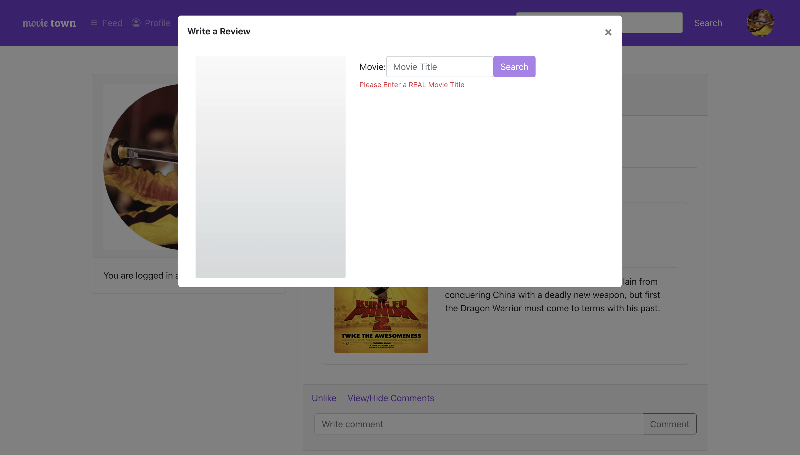

# Group Z Project - Movie Town

<!--Feel free to change the headings around, not sure what they should be set to.-->

## Outline	
<!--Copy this from project proposal I reckon-->
An outline of the application you were aiming to build, target users, data sources etc (similar to the proposal). Include link to Github

## What We've Achieved
Addressing milestones	A description of what you have been able to implement in this MVP, use your milestones to highlight what you've achieved

## Source Code
Our project has various pages and various components. For the front end, We will break up the source code description section into components.

### Front End
#### _Login/Registration_

#### _Movie Card_

#### _Review Card_

#### _Navigation Bar_

#### _Search Bar_

#### _Write Review Modal_

#### _Home Feed_

#### _Profile_

#### _My Movies_

#### _My Reviews_

#### _About_

### Back End

#### _User Services_

#### _Review Services_

#### _OMDB Services_

## Future work	
A summary of what your next steps would be if you were to continue the project

## Roles/Contributions	
Each group member contributed to various elements of the project. This differed from what we initially planned in our Project Proposal. As we each picked up tasks, we took on responsibilities for different elements of the project.

### Team Roles
#### _Bradley:_
* Brad did this

#### _Cecilia:_
* Cece did that

#### _George:_
* George is the coolest

#### _Sophie:_
* Sophie did things too

### Communication/Interactions
* Each week in our weekly COMP3120 workshop, our group would work together to decide what each member would work on for the week. This was also a time where we could assist each other with any errors we had come across, or discuss ideas for the project.
* We used Facebook Messenger to communicate throughout the project and to suggest ideas and improvement.
* We utilised pull requests in [GitHub](https://github.com/MQCOMP3120-2020/group-project-group-z) so any new functionality is reviewed by another group member before that code is merged into the master branch. This also helped with testing functionality so we didn't introduce too much bugs.
* A [Google Sheets Spreadsheet](https://docs.google.com/spreadsheets/d/1DTJB87OywgLXMo6mj35LikxVFykVOYqeornXXZ_rcb8/edit?usp=sharing) was used to keep track of what tasks members were responsible for that week. It included a section called "small tasks", so any members who had extra time in the week could pick up smaller tasks to implement into the project. This worked well, because if anyone had any new ideas, they could add it into the smaller tasks section for later. This also helped us keep track of bugs.
